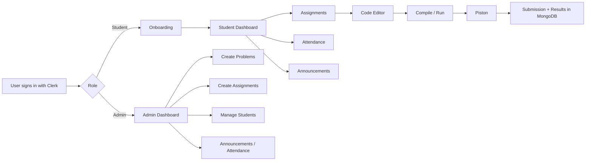
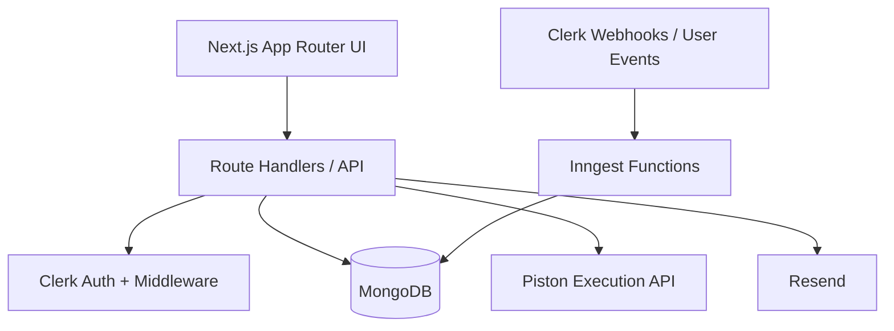

# Algo-Grade

<p align="center">
  <strong>A full-stack DAA course portal for assignments, auto-grading, attendance, announcements, and role-based academic workflows.</strong>
</p>

<p align="center">
  Built with Next.js 16, React 19, Clerk, MongoDB, Tailwind CSS 4, and a self-hosted Piston execution engine.
</p>

<p align="center">
  
  
  
  
  
  
</p>

---

## Overview

`Algo-Grade` is a course portal built for **Design and Analysis of Algorithms (DAA)** workflows. It gives students a dedicated place to view assignments, write code, run solutions, submit answers, track attendance, read announcements, and review results. On the admin side, it provides tools to manage problems, assemble assignments, monitor submissions, handle attendance, and onboard admin users safely.

The project uses:

- **Clerk** for authentication and identity
- **MongoDB + Mongoose** for application data
- **Piston** for multi-language code execution
- **Next.js App Router** for UI and API routes
- **Inngest** for user-sync event handling
- **Resend** for welcome-email delivery

---

## What The Project Does

### For Students

- Sign in and complete onboarding using an `@iiitdmj.ac.in` email
- Auto-detect roll number from the college email
- Browse active and upcoming assignments
- Open a problem set and code directly in the browser
- Run code and submit solutions in multiple languages
- View recent results, scores, and dashboard summaries
- Track class and assignment attendance
- Read announcements and updates

### For Admins

- Access a dedicated admin dashboard
- Create and manage problems with:
  - descriptions
  - constraints
  - examples
  - visible/hidden test cases
  - starter code for multiple languages
- Create assignments by combining problems and setting publish/due dates
- Manage students and users
- Track attendance
- Publish announcements
- Create pending admin accounts through a protected setup flow
- Send welcome emails

---

## Core Highlights

- **Role-based experience**: student and admin users are separated through Clerk metadata plus MongoDB-backed checks.
- **Auto-grading workflow**: code is executed against test cases through a self-hosted Piston service.
- **Multi-language support**: current language support includes `C++`, `Java`, `Python`, and `JavaScript`.
- **Real course workflows**: attendance, announcements, onboarding, submission history, and admin setup are all part of the product.
- **Docker-ready local stack**: the repo includes `Dockerfile`, `docker-compose.yml`, and a `Makefile` for app + MongoDB + Piston.
- **Modern UI**: responsive interface built with Tailwind CSS, shadcn/ui-style components, CodeMirror, and polished dashboard pages.

---

## Product Flow



---

## Tech Stack

| Layer | Tools |
| --- | --- |
| Frontend | Next.js 16, React 19, TypeScript, Tailwind CSS 4 |
| UI | Radix-based UI patterns, shadcn-style components, Lucide icons, Motion |
| Auth | Clerk |
| Database | MongoDB, Mongoose |
| Code Execution | Self-hosted Piston |
| Async / Events | Inngest |
| Email | Resend |
| Charts / Visuals | Recharts, custom attendance heatmap |
| Editor | CodeMirror 6 |

---

## Architecture



### Important implementation pieces

- `src/proxy.ts`
  Route protection, admin redirects, onboarding enforcement, and student/admin route separation.

- `src/lib/auth.ts`
  Admin verification helper that checks Clerk metadata and MongoDB, and can auto-sync missing admin records.

- `src/lib/piston.ts`
  Central code execution utility for running code and grading test cases.

- `src/inngest/functions.ts`
  Syncs Clerk users into MongoDB on create/update and removes them on deletion.

- `src/models/*`
  Mongoose models for users, assignments, problems, submissions, attendance, announcements, and email logs.

---

## Data Model

The project currently defines these main collections:

| Model | Purpose |
| --- | --- |
| `User` | Stores app-level user profile, role, email, roll number, and Clerk linkage |
| `Problem` | Problem statement, difficulty, marks, examples, test cases, starter code |
| `Assignment` | Assignment metadata, publish/due dates, and linked problem IDs |
| `Submission` | Student code submissions, language, score, execution data, and test results |
| `Attendance` | Class and assignment attendance sessions with per-student records |
| `Announcement` | Published course updates with type, priority, and schedule fields |
| `EmailLog` | Audit trail for emails sent through Resend |

---

## Key Features In This Repo

### 1. Secure onboarding

- Student onboarding validates roll number format
- Roll number must match the signed-in IIITDMJ email
- Admin onboarding supports pre-created pending admins

### 2. Assignment workflow

- Admins create problems first
- Assignments are built by selecting problem-bank entries
- Students see publish/due state and can work problem-by-problem

### 3. Code execution

- `POST /api/compile` supports:
  - run code with stdin
  - run code against test cases
- Execution returns output, errors, timing, and memory usage

### 4. Submission evaluation

- Submission records store code, language, score, and detailed test results
- Students can review recent performance from the dashboard and results page

### 5. Attendance tracking

- Attendance supports both `class` and `assignment` session types
- Assignment attendance can be synced when a student opens an assignment
- Students get summary cards and a heatmap view

### 6. Admin setup flow

- Admins can be created using a protected setup endpoint
- Pending admins are stored before first login
- On first successful login, the `pending_` Clerk ID is replaced with the real one

### 7. Announcements and email

- Admin-created announcements are available to students
- Welcome emails are sent through Resend and logged in MongoDB

---

## Project Structure

```text
daa-portal/
├── src/
│   ├── app/
│   │   ├── (auth)/                # landing page
│   │   ├── (dashboard)/           # student-facing routes
│   │   ├── (dashboardAdmin)/      # admin-facing routes
│   │   └── api/                   # route handlers
│   ├── components/                # shared UI and domain components
│   ├── hooks/                     # reusable hooks
│   ├── inngest/                   # Inngest client and functions
│   ├── lib/                       # auth, db, piston, email utilities
│   └── models/                    # Mongoose models
├── public/                        # static assets
├── scripts/                       # utility/admin scripts
├── Dockerfile
├── docker-compose.yml
├── Makefile
└── README.md
```

---

## Main Routes

### Student pages

- `/`
- `/onboarding`
- `/home`
- `/assignment`
- `/assignment/[id]`
- `/submission`
- `/results`
- `/attendance`
- `/announcements`

### Admin pages

- `/admin`
- `/admin/problems`
- `/admin/problems/create`
- `/admin/assignments`
- `/admin/assignments/create`
- `/admin/students`
- `/admin/users`
- `/admin/announcements`
- `/admin/handle-attendance`
- `/setup-admin`

---

## Local Development

### Prerequisites

Make sure you have:

- `Node.js 20+`
- `npm`
- a MongoDB instance
- a Clerk application
- Docker, if you want local Piston execution through containers

### 1. Install dependencies

```bash
npm install
```

### 2. Create `.env.local`

Use values like these:

```env
# Clerk
CLERK_SECRET_KEY=sk_test_...
NEXT_PUBLIC_CLERK_PUBLISHABLE_KEY=pk_test_...
NEXT_PUBLIC_CLERK_SIGN_IN_URL=/sign-in
NEXT_PUBLIC_CLERK_SIGN_UP_URL=/sign-up

# Database
MONGODB_URI=mongodb://localhost:27017/daa-portal

# Code execution
PISTON_API_URL=http://localhost:2000/api/v2

# Admin setup
ADMIN_SETUP_SECRET=replace_with_a_strong_secret

# Optional email support
RESEND_API_KEY=re_...
FROM_EMAIL=onboarding@your-domain.com
```

### 3. Start the app

```bash
npm run dev
```

The app will be available at [http://localhost:3000](http://localhost:3000).

---

## Docker Workflow

This repo includes a ready-to-use local container stack for:

- Next.js app
- MongoDB
- Piston

### Start everything

```bash
make up
```

or

```bash
docker compose up -d --build
```

### Stop everything

```bash
make down
```

### View logs

```bash
make logs
```

### Clean containers and volumes

```bash
make clean
```

### Important note

`docker-compose.yml` injects:

- `MONGODB_URI=mongodb://mongo:27017/daa-portal`
- `PISTON_API_URL=http://piston:2000/api/v2`

So if you run through Docker Compose, the app talks to the containerized services automatically.

---

## Environment Variables

| Variable | Required | Purpose |
| --- | --- | --- |
| `CLERK_SECRET_KEY` | Yes | Server-side Clerk authentication |
| `NEXT_PUBLIC_CLERK_PUBLISHABLE_KEY` | Yes | Client-side Clerk setup |
| `NEXT_PUBLIC_CLERK_SIGN_IN_URL` | Recommended | Sign-in route for Clerk |
| `NEXT_PUBLIC_CLERK_SIGN_UP_URL` | Recommended | Sign-up route for Clerk |
| `MONGODB_URI` | Yes | MongoDB connection string |
| `PISTON_API_URL` | Yes | Base URL of the Piston API |
| `ADMIN_SETUP_SECRET` | Recommended | Secret for protected admin creation |
| `RESEND_API_KEY` | Optional | Required only if using welcome email flow |
| `FROM_EMAIL` | Optional | Sender address for welcome emails |

---

## How Admin Setup Works

The repository includes a protected admin creation flow:

1. An initial admin can be created through `/api/admin/setup`.
2. If the user has not signed in yet, the app stores a placeholder `clerkId` in the form `pending_<email>`.
3. On first real login, the app replaces the placeholder with the actual Clerk user ID.
4. Clerk metadata is updated so the user is treated as an admin on future requests.

This makes the admin onboarding flow safer and easier to control for academic deployments.

---

## API Areas

The API surface is organized by responsibility:

| Area | Examples |
| --- | --- |
| Student | `/api/student/dashboard`, `/api/student/assignments`, `/api/student/results` |
| Admin | `/api/admin/problems`, `/api/admin/assignments`, `/api/admin/students` |
| Platform | `/api/compile`, `/api/health`, `/api/onboarding/complete` |
| Attendance | `/api/attendance/sync-assignment` |
| Email | `/api/admin/email/welcome` |
| Background / Events | `/api/inngest` |

---

## Scripts

There is a small `scripts/` area for maintenance and admin workflows.

See [scripts/README.md](./scripts/README.md) for details.

Current script documentation focuses on:

- auditing users
- checking pending admins
- admin cleanup workflows
- fixing the old `rollNo` index issue

---

## Deployment Notes

- `next.config.ts` uses `output: "standalone"` for container-friendly builds.
- The `Dockerfile` builds a standalone Next.js image and exposes port `3000`.
- `/api/health` is available for health checks.

---

## Development Notes

- The project uses **App Router** route groups like `(dashboard)` and `(dashboardAdmin)`.
- MongoDB connections are cached globally to avoid repeated connections during development.
- Inngest is already wired for Clerk user sync events.
- Use `npm run dev:inngest` if you want to run the local Inngest dev server alongside the app.
- Code execution is intentionally separated behind `src/lib/piston.ts`, which makes the grading flow easier to evolve later.

---

## Best Fit Use Case

This codebase is a strong fit if you want to build or extend:

- a DAA lab portal
- an auto-grading academic platform
- a coding assignment system with admin workflows
- a college internal portal with role-based dashboards

---

## Status

This is not a bare starter template. It is an actively structured academic product with:

- student and admin dashboards
- real database models
- protected route flows
- auto-grading support
- attendance tracking
- announcements
- email and admin utilities

If you want to improve it further, the next natural additions would be test coverage, stronger env validation, and production deployment hardening.

---

## License

Add your preferred license here if this project will be shared publicly.
