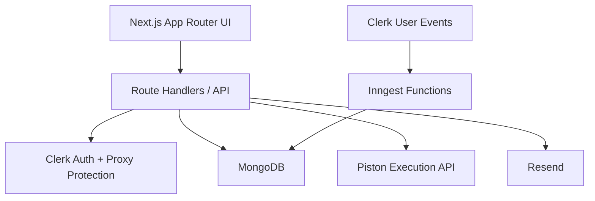

# Algo-Grade

<p align="center">
  <strong>A full-stack academic portal for DAA coursework, auto-grading, attendance, announcements, and role-based admin workflows.</strong>
</p>

<p align="center">
  Built with Next.js 16, React 19, Clerk, MongoDB, Tailwind CSS 4, Inngest, Resend, and a self-hosted Piston code execution service.
</p>

<p align="center">
  
  
  
  
  
  
</p>

---

## Overview

Algo-Grade is a course portal for **Design and Analysis of Algorithms (DAA)** workflows. It gives students a focused place to browse assignments, solve coding problems, run code, submit answers, track attendance, and review results. It also gives admins a dedicated control surface for managing problems, assignments, students, users, attendance, and announcements.

The project combines:

- **Clerk** for authentication and role-aware identity flows
- **MongoDB + Mongoose** for application data
- **Piston** for multi-language code execution
- **Next.js App Router** for UI and API routes
- **Inngest** for Clerk-to-database sync jobs
- **Resend** for welcome email delivery

---

## Product Highlights

### Student experience

- Sign in with Clerk and complete onboarding
- Auto-fill academic details from the institutional email flow
- Browse active, upcoming, and completed assignments
- Open assignment problems and code directly in the browser
- Run solutions before submitting
- Review scores, submissions, and dashboard summaries
- Track attendance and course activity
- Read announcements and updates

### Admin experience

- Use a dedicated admin dashboard
- Create and manage coding problems
- Build assignments from the problem bank
- Manage students and platform users
- Handle attendance sessions and summaries
- Publish announcements
- Create admin accounts through a protected setup flow
- Send welcome emails to newly created users

### Platform capabilities

- Role-based student and admin routing
- Multi-language code execution with Piston
- MongoDB-backed course, submission, and attendance data
- Clerk metadata + database sync with Inngest
- Docker-ready local stack for the app, MongoDB, and Piston

---

## Tech Stack

| Layer | Tools |
| --- | --- |
| Frontend | Next.js 16, React 19, TypeScript |
| Styling | Tailwind CSS 4, Motion, Lucide |
| UI Patterns | Radix-based and shadcn-style components |
| Auth | Clerk |
| Database | MongoDB, Mongoose |
| Code Execution | Self-hosted Piston |
| Background Jobs | Inngest |
| Email | Resend |
| Charts and Visuals | Recharts |
| Editor | CodeMirror 6 |

---

## Core Features

### Assignments and grading

- Admins create problems with examples, constraints, starter code, and test cases
- Assignments are built by combining problem records
- Students can run code before submission
- Submission data stores code, language, status, score, and detailed results

### Attendance and activity

- Separate attendance flows for `class` and `assignment` sessions
- Student-facing attendance summaries and heatmap-style views
- Admin attendance handling from the dashboard

### Identity and onboarding

- Clerk-based sign-in and route protection
- Role-aware redirects between student and admin areas
- Onboarding completion tracked in Clerk metadata
- Protected admin bootstrap flow using a shared secret

### Announcements and communication

- Admin-created announcements for students
- Welcome email flow through Resend
- MongoDB email logging support

---

## Architecture



### Important implementation files

- `src/proxy.ts`
  Route protection, onboarding enforcement, and student/admin separation.

- `src/lib/auth.ts`
  Admin verification logic with Clerk metadata and MongoDB fallback.

- `src/lib/piston.ts`
  Shared code execution and grading integration.

- `src/inngest/functions.ts`
  Syncs Clerk users into MongoDB and removes deleted users.

- `src/models/*`
  Data models for users, assignments, problems, submissions, attendance, announcements, and email logs.

---

## Data Model

| Model | Purpose |
| --- | --- |
| `User` | App user profile, role, roll number, email, and Clerk linkage |
| `Problem` | Problem statement, difficulty, marks, examples, test cases, and starter code |
| `Assignment` | Assignment metadata, publish/due dates, and linked problems |
| `Submission` | Student submissions, score, language, and evaluation details |
| `Attendance` | Class and assignment attendance records |
| `Announcement` | Course updates with type, priority, and publish state |
| `EmailLog` | Email delivery audit trail |

---

## Main Routes

### Student routes

- `/`
- `/onboarding`
- `/home`
- `/assignment`
- `/assignment/[id]`
- `/submission`
- `/results`
- `/attendance`
- `/announcements`

### Admin routes

- `/admin`
- `/admin/users`
- `/admin/students`
- `/admin/create-admin`
- `/admin/assignments`
- `/admin/assignments/create`
- `/admin/problems`
- `/admin/problems/create`
- `/admin/announcements`
- `/admin/handle-attendance`
- `/setup-admin`

---

## Project Structure

```text
daa-portal/
├── src/
│   ├── app/
│   │   ├── (auth)/             # public and auth-related pages
│   │   ├── (dashboard)/        # student-facing routes
│   │   ├── (dashboardAdmin)/   # admin-facing routes
│   │   └── api/                # route handlers
│   ├── components/             # shared UI and feature components
│   ├── inngest/                # Inngest client and functions
│   ├── lib/                    # auth, db, piston, email, helpers
│   ├── models/                 # Mongoose models
│   └── proxy.ts                # Clerk route protection
├── public/
├── Dockerfile
├── docker-compose.yml
├── Makefile
└── README.md
```

---

## Getting Started

### Prerequisites

Make sure you have:

- `Node.js 20+`
- `npm`
- a MongoDB instance
- a Clerk application
- Docker, if you want to run MongoDB and Piston locally in containers

### 1. Install dependencies

```bash
npm install
```

### 2. Create `.env.local`

Use a local environment file with values like these:

```env
# Clerk
CLERK_SECRET_KEY=sk_test_...
NEXT_PUBLIC_CLERK_PUBLISHABLE_KEY=pk_test_...
NEXT_PUBLIC_CLERK_SIGN_IN_URL=/sign-in
NEXT_PUBLIC_CLERK_SIGN_UP_URL=/sign-up

# Database
MONGODB_URI=mongodb://localhost:27017/daa-portal

# Code execution
PISTON_API_URL=http://localhost:2000/api/v2

# Admin bootstrap
ADMIN_SETUP_SECRET=replace_with_a_strong_secret

# Optional email support
RESEND_API_KEY=re_...
FROM_EMAIL=onboarding@your-domain.com
```

### 3. Start the app

```bash
npm run dev
```

The app will be available at [http://localhost:3000](http://localhost:3000).

### 4. Optional: start the Inngest dev server

```bash
npm run dev:inngest
```

---

## Docker Workflow

This repository includes a local Docker stack for:

- the Next.js app
- MongoDB
- Piston

### Start everything

```bash
make up
```

or

```bash
docker compose up -d --build
```

### Stop everything

```bash
make down
```

### View logs

```bash
make logs
```

### Clean containers and volumes

```bash
make clean
```

### Docker notes

- `docker-compose.yml` overrides `MONGODB_URI` to `mongodb://mongo:27017/daa-portal`
- `docker-compose.yml` overrides `PISTON_API_URL` to `http://piston:2000/api/v2`
- `Makefile` reads `.env.local`, so Clerk build args stay available during container builds
- The `Dockerfile` builds a standalone Next.js image and exposes port `3000`

---

## Environment Variables

| Variable | Required | Purpose |
| --- | --- | --- |
| `CLERK_SECRET_KEY` | Yes | Server-side Clerk authentication |
| `NEXT_PUBLIC_CLERK_PUBLISHABLE_KEY` | Yes | Client-side Clerk configuration |
| `NEXT_PUBLIC_CLERK_SIGN_IN_URL` | Recommended | Clerk sign-in route |
| `NEXT_PUBLIC_CLERK_SIGN_UP_URL` | Recommended | Clerk sign-up route |
| `MONGODB_URI` | Yes | MongoDB connection string |
| `PISTON_API_URL` | Yes | Base URL for the Piston API |
| `ADMIN_SETUP_SECRET` | Recommended | Secret used by the protected admin setup flow |
| `RESEND_API_KEY` | Optional | Needed for welcome email sending |
| `FROM_EMAIL` | Optional | Sender address for outgoing mail |

---

## API Areas

| Area | Examples |
| --- | --- |
| Student | `/api/student/dashboard`, `/api/student/assignments`, `/api/student/results` |
| Admin | `/api/admin/problems`, `/api/admin/assignments`, `/api/admin/students`, `/api/admin/users` |
| Platform | `/api/compile`, `/api/health`, `/api/onboarding/complete` |
| Attendance | `/api/attendance/sync-assignment`, `/api/student/attendance` |
| Email | `/api/admin/email/welcome` |
| Events | `/api/inngest` |

---

## Admin Setup Flow

The project includes a protected admin bootstrap process:

1. An admin record can be created through `/api/admin/setup`.
2. If that person has not signed in yet, the app stores a placeholder Clerk ID in the form `pending_<email>`.
3. On first real login, the placeholder is replaced with the actual Clerk user ID.
4. Clerk metadata is updated so future requests are treated as admin requests immediately.

This makes it easier to control admin access in academic deployments without manually editing database records.

---

## Development Notes

- The app uses **App Router** route groups for student and admin areas.
- MongoDB connections are cached globally for better development behavior.
- Clerk role data is reinforced with MongoDB checks in `src/lib/auth.ts`.
- Inngest is already wired to process Clerk user events.
- Code execution is intentionally isolated behind `src/lib/piston.ts`.
- `/api/health` is available for local and container health checks.

---

## Current Status

This is not a starter template. The repository already contains:

- student and admin dashboards
- onboarding and role-based routing
- assignment and problem management
- submission and evaluation flows
- attendance tracking
- announcements
- welcome email support
- Docker-based local infrastructure

Natural next improvements would be automated tests, stronger environment validation, and production hardening.

---

## License

Add your preferred license here if you plan to distribute the project publicly.
